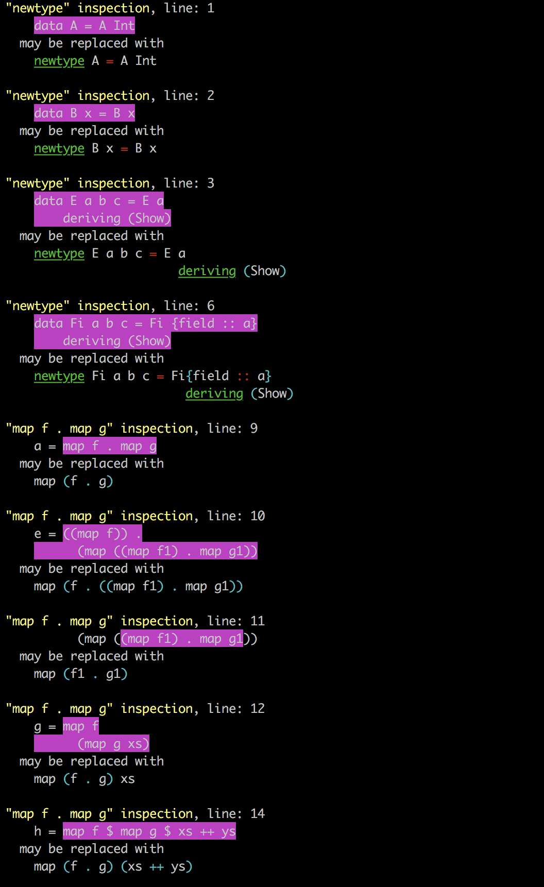

# hs-analyzer

hs-analyzer is simple static analyser which detects two things:
1. `data` which can be replaced with `newtype`
2. `map f . map g` usage which can be replaced with `map (f . g)`. Infix ``map`` isn't supported

## How to build?
`stack build hs-analyzer`

## How to run?
`stack exec -- hs-analyzer file.hs`

## Example of ouput
 `test1.hs` contains:

```
data A = A Int
data B x = B x
data E a b c = E a
    deriving (Show)

data Fi a b c = Fi {field :: a}
    deriving (Show)

a = map f . map g
e = ((map f)) .
      (map ((map f1) . map g1))
g = map f
      (map g xs)
h = map f $ map g $ xs ++ ys

```

`stack exec -- hs-analyzer test1.hs` produces:


Yellow text corresponds to a name of inspecting feature.
Pink background corresponds to replacing piece of code.
